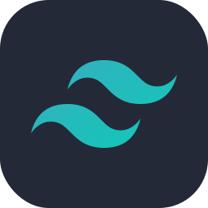
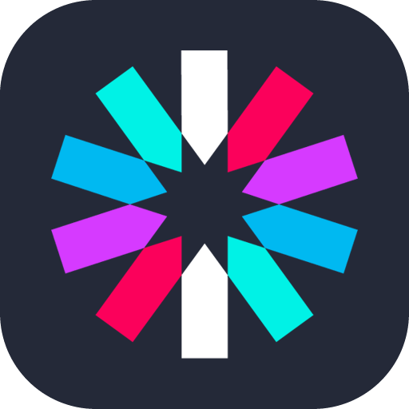
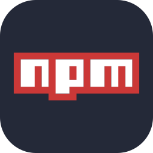

 

## 👨💻 Developer Snapshot

### 🔭 **Current Focus:** Architecting scalable, AI-integrated full-stack applications and leading development teams.

### ⚡ **Core Arsenal:** Next.js 16, React 19, and MERN stack, with advanced Stripe & NextAuth integrations.

### 🎯 **Professional Goal:** Engineering secure, high-performance web platforms with clean, maintainable code.

### 💡 **Philosophy:** Bridging complex backend architectures with pixel-perfect, intuitive user experiences.

 

 

## 📊 Current Stats

 

  

 

## ⚙️ Technical Ecosystem

### **Frontend Architecture**

  
  
  
  
  
  

### **Backend & Database**

  
  
  
  
  
  

### **Tools & Infrastructure**

  
  
  
  
  

## 🏗️ Featured Engineering

 

<table align="center" style="border-collapse: collapse; border: none;">
  <tr style="border: none;">
    <td width="50%" align="center" valign="center" style="border: none;">
      
    </td>
    <td width="50%" valign="top" style="border: none; padding-left: 20px;">
      <h3>🟢 Fit Flow Pro</h3>
      
<b>Elevate Your Fitness with AI-Driven Intelligence.</b>

      
A next-generation activity tracking ecosystem that transforms your raw health data into personalized, actionable insights through real-time analytics.

      
<b>Core Arsenal:</b> Next.js 16, React 19, Tailwind, Node.js, MongoDB, AI Models.

       
      <a href="LIVE_SITE_LINK">🔗 Live App</a> &nbsp;|&nbsp; 
      <a href="GITHUB_CLIENT_LINK">💻 Client</a> &nbsp;|&nbsp; 
      <a href="GITHUB_SERVER_LINK">⚙️ Server</a>
    </td>
  </tr>
</table>

  

<table align="center" style="border-collapse: collapse; border: none;">
  <tr style="border: none;">
    <td width="50%" valign="top" style="border: none; padding-right: 20px;">
      <h3>🔴 BloodLine</h3>
      
<b>Secure Blood Donation & Funding Ecosystem.</b>

      
Engineered a high-performance MERN architecture with secure checkout sessions, role-based access verification, and one-click report generation.

      
<b>Core Arsenal:</b> React 19, Express.js, MongoDB, Stripe, Firebase Admin SDK.

       
      <a href="LIVE_SITE_LINK">🔗 Live App</a> &nbsp;|&nbsp; 
      <a href="GITHUB_CLIENT_LINK">💻 Client</a> &nbsp;|&nbsp; 
      <a href="GITHUB_SERVER_LINK">⚙️ Server</a>
    </td>
    <td width="50%" align="center" valign="center" style="border: none;">
      
    </td>
  </tr>
</table>

  

<table align="center" style="border-collapse: collapse; border: none;">
  <tr style="border: none;">
    <td width="50%" align="center" valign="center" style="border: none;">
      
    </td>
    <td width="50%" valign="top" style="border: none; padding-left: 20px;">
      <h3>🔵 PrimeCare</h3>
      
<b>Automated Care Service Booking.</b>

      
Built a fully SEO-optimized, full-stack booking architecture with secure session management and automated email invoicing.

      
<b>Core Arsenal:</b> Next.js 16, Tailwind, NextAuth.js, MongoDB, Nodemailer.

       
      <a href="LIVE_SITE_LINK">🔗 Live App</a> &nbsp;|&nbsp; 
      <a href="GITHUB_REPO_LINK">💻 Source Code</a>
    </td>
  </tr>
</table>

 

## 📫 Connect With Me

 

[
](https://linkedin.com/in/hadihamza)[ 
](https://hadialhamza.vercel.app)

 
